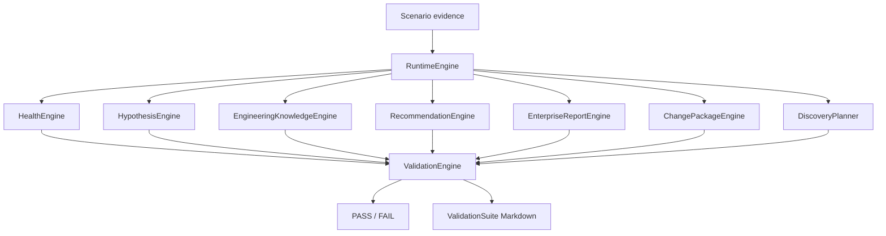

# 09 — Enterprise Validation Engine

> **Status:** Implemented

## Purpose

Document the enterprise validation suite that exercises existing investigation pipelines and verifies deterministic, repeatable outcomes without introducing new investigation logic.

## Repository Modules Involved

| Module | Role |
|--------|------|
| [`../../core/validation/validation_engine.py`](../../core/validation/validation_engine.py) | `ValidationEngine` — scenario orchestration |
| [`../../core/validation/validation_models.py`](../../core/validation/validation_models.py) | Immutable validation domain models |
| [`../../core/validation/validation_rules.py`](../../core/validation/validation_rules.py) | Expectation evaluation rules |
| [`../../core/validation/validation_report.py`](../../core/validation/validation_report.py) | Markdown suite reports |
| [`../../core/runtime/scenario_runner.py`](../../core/runtime/scenario_runner.py) | Scenario evidence and pipeline helpers |
| [`../../cli/voicepilot_cli.py`](../../cli/voicepilot_cli.py) | `voicepilot validate` command |

## Architecture

## Design Constraints

- **Read-only:** validates uploaded scenario evidence only
- **No new investigation logic:** reuses `RuntimeEngine` and existing engines
- **Deterministic:** same scenario evidence produces the same pass/fail outcome
- **Playbook-scoped:** `VP-CUBE-0001` and `VP-CUCM-0001` scenario packs

## Related Tests

- [`../../tests/test_validation_engine.py`](../../tests/test_validation_engine.py)
- [`../../tests/test_vp_cube_0001_scenarios.py`](../../tests/test_vp_cube_0001_scenarios.py)
- [`../../tests/test_vp_cucm_0001_scenarios.py`](../../tests/test_vp_cucm_0001_scenarios.py)

## Related Documentation

- [`../../docs/sprint-11/enterprise-validation-suite-v1.md`](../../docs/sprint-11/enterprise-validation-suite-v1.md)
- [01 — Investigation Workflow Engines](01-investigation-workflow-engines.md)
- [Part 4 — Demo and Examples](../part-4-platform/02-demo-and-examples.md)

## Cross References

- Scenario regression predates this engine via `voicepilot scenarios`
- Enterprise validation extends scenario checks with health, knowledge, change package, report, quality, and performance metrics
