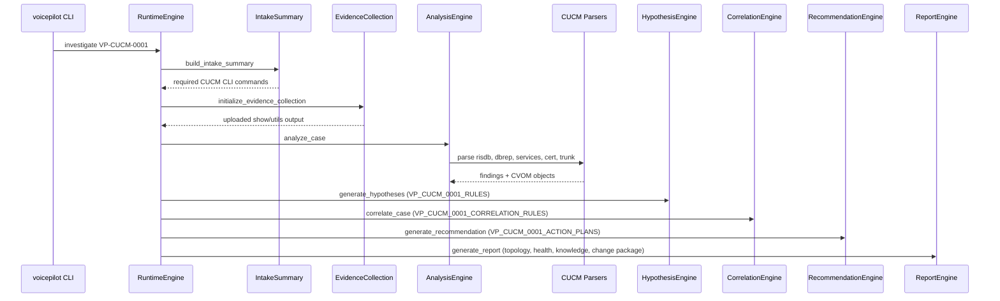

# 06 — Cisco CUCM Investigation Pipeline

> **Status:** Implemented

## Purpose

Document the deterministic Cisco CUCM investigation pipeline introduced in Sprint 11.3: playbook `VP-CUCM-0001`, CUCM evidence parsers, CVOM extensions, health rules, hypotheses, correlation, recommendations, topology, and scenario regression.

## Repository Modules Involved

| Layer | Module |
|-------|--------|
| Playbook | [`../../plugins/cisco/playbooks/cucm/vp-cucm-0001-cisco-cucm-investigation.vpb.yaml`](../../plugins/cisco/playbooks/cucm/vp-cucm-0001-cisco-cucm-investigation.vpb.yaml) |
| Investigation rules | [`../../core/runtime/cucm_investigation.py`](../../core/runtime/cucm_investigation.py) |
| CVOM | [`../../core/model/cucm_objects.py`](../../core/model/cucm_objects.py) |
| Parsers | [`../../plugins/cisco/parser/cucm/`](../../plugins/cisco/parser/cucm/) |
| Health | [`../../core/health/cucm_rules.py`](../../core/health/cucm_rules.py) |
| Topology | [`../../core/topology/relationship_builder.py`](../../core/topology/relationship_builder.py) |
| Intake | [`../../core/runtime/intake_summary.py`](../../core/runtime/intake_summary.py) |
| Change package | [`../../core/change_package/change_engine.py`](../../core/change_package/change_engine.py) |
| Scenarios | [`../../examples/sample_evidence/scenarios/vp_cucm_0001/`](../../examples/sample_evidence/scenarios/vp_cucm_0001/) |
| Knowledge | [`../../knowledge/incidents/cisco/cucm/`](../../knowledge/incidents/cisco/cucm/) |

## Pipeline Flow

## Design Constraints

- **Read-only:** parsers consume pasted CLI output; no live CUCM connection
- **Deterministic:** no AI inference; signal → hypothesis → correlation → recommendation
- **Playbook-scoped:** CUCM rules dispatch when `playbook_id == VP-CUCM-0001`
- **Knowledge-linked:** recommendations reference `VP-CISCO-CUCM-RB-*` runbooks and `VP-CISCO-CUCM-VG-*` verification guides

## Related Tests

- [`../../tests/test_cucm_investigation_engine.py`](../../tests/test_cucm_investigation_engine.py)
- [`../../tests/test_vp_cucm_0001_scenarios.py`](../../tests/test_vp_cucm_0001_scenarios.py)
- [`../../tests/test_cucm_knowledge_library.py`](../../tests/test_cucm_knowledge_library.py)

## Related Documentation

- [`../../docs/sprint-11/cucm-investigation-engine-v1.md`](../../docs/sprint-11/cucm-investigation-engine-v1.md)
- [`../../docs/sprint-11/cucm-professional-pack-v1.md`](../../docs/sprint-11/cucm-professional-pack-v1.md)
- [05 — Cisco Plugin](05-cisco-plugin.md)
- [Part 3 — Investigation Workflow Engines](../part-3-engines/01-investigation-workflow-engines.md)

## Cross References

- VP-CUBE-0001 remains the CUBE outbound-failure reference implementation
- Report, comparison, and change-package engines reuse existing platform logic without CUCM-specific report duplication
