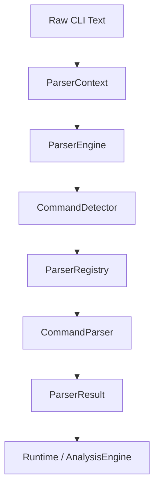

# VoicePilot Parser Framework

Architecture for deterministic, vendor-pluggable CLI output parsing.

## Overview

VoicePilot investigations collect large amounts of pasted CLI output. Today, Sprint 1 analysis uses lightweight pattern matching on raw text. The parser framework introduces a **Wireshark / Nmap / Genie / pyATS-inspired** pipeline:

1. **Detect** which command produced the output
2. **Dispatch** to a vendor-specific parser
3. **Validate** structured intermediate representation
4. **Extract** metadata and investigation findings
5. **Return** a `ParserResult` for the runtime to consume

Parsers are **pure**. They never read or mutate `Case`. The runtime and analysis engines decide how findings affect investigation state.

## Architecture



### Core Components

| Component | Location | Role |
|-----------|----------|------|
| `CommandParser` | `core/parser/interfaces.py` | Vendor parser contract |
| `CommandDetector` | `core/parser/command_detector.py` | Fingerprint CLI command from raw text |
| `ParserRegistry` | `core/parser/parser_registry.py` | Multi-vendor parser lookup |
| `ParserContext` | `core/parser/parser_context.py` | Provenance and device context |
| `ParserResult` | `core/parser/parser_result.py` | Structured parse output |
| `ParserEngine` | `core/parser/parser_engine.py` | Orchestration entry point |

## CommandParser Interface

Every vendor parser implements:

```python
class CommandParser(ABC):
    vendor: str
    command: str
    parser_version: str

    def detect(self, raw_text: str, context: ParserContext | None = None) -> bool: ...
    def parse(self, raw_text: str, context: ParserContext) -> ParserResult: ...
    def validate(self, structured_data: JsonDict) -> list[str]: ...
    def extract_findings(self, structured_data: JsonDict, context: ParserContext) -> list[ParserFinding]: ...
    def extract_metadata(self, structured_data: JsonDict, context: ParserContext) -> JsonDict: ...
```

### Method Responsibilities

| Method | Purpose |
|--------|---------|
| `detect()` | Fast pre-check: can this parser handle the blob? |
| `parse()` | Full parse pipeline → `ParserResult` |
| `validate()` | Schema / semantic checks on structured data |
| `extract_findings()` | Map structured fields → investigation signals |
| `extract_metadata()` | Hostname, platform, IOS version, etc. |

## ParserResult

Uniform output envelope for every parser:

| Field | Description |
|-------|-------------|
| `command` | Normalized CLI command |
| `hostname` | Device hostname if discovered |
| `platform` | Hardware / product family |
| `ios_version` | Software version |
| `parser_version` | Parser implementation version |
| `warnings` | Non-fatal parse issues |
| `errors` | Blocking parse failures |
| `metadata` | Additional key/value metadata |
| `structured_data` | Vendor-neutral or semi-structured tree |
| `findings` | List of `ParserFinding` (signal + confidence) |
| `confidence` | Overall parse confidence (0–100) |

## ParserContext

Immutable context supplied by the runtime:

| Field | Description |
|-------|-------------|
| `vendor` | e.g. `cisco`, `microsoft`, `ribbon` |
| `platform` | e.g. `CUBE`, `CUCM` |
| `ios_version` | Known or inferred software version |
| `hostname` | Known device hostname |
| `case_id` | Active investigation case |
| `device_id` | Topology device reference |
| `timezone` | Collection timezone |
| `collection_timestamp` | When output was collected |

## Command Detection

`CommandDetector` maintains a catalog of known commands:

- `show version`
- `show sip-ua status`
- `show dial-peer voice summary`
- `show running-config`
- `debug ccsip messages`
- `show call active voice brief`
- `show voice class codec`
- `show license summary`
- `show inventory`
- `show platform`

Future implementations will use header fingerprints, prompt patterns, and field signatures — similar to Wireshark protocol dissectors — without requiring the engineer to re-type the command.

## Parser Registry

`ParserRegistry` maps `(vendor, command)` → `CommandParser`.

```python
registry = ParserRegistry()
registry.register(ShowSipUaStatusParser())  # vendor=cisco, command=show sip-ua status
parser = registry.get_parser("cisco", "show sip-ua status")
```

Multiple vendors coexist in one registry. Lookup keys are normalized (lowercase, collapsed whitespace).

## Parser Engine Flow

```python
engine = ParserEngine(registry=registry, detector=CommandDetector())
result = engine.parse(raw_text, context)
```

1. If `command` is not provided, `CommandDetector.detect()` runs.
2. `ParserRegistry.get_parser(vendor, command)` resolves the parser.
3. `CommandParser.parse()` returns `ParserResult`.
4. Caller (runtime) maps findings to `AnalysisFinding` and updates case state.

## Plugin Model

Vendor code lives under `plugins/<vendor>/parser/`:

```
plugins/
  cisco/parser/       ← Cisco IOS / CUBE parsers
  microsoft/parser/   ← Teams / SBC (future)
  ribbon/parser/      ← SBC (future)
  audiocodes/parser/  ← Mediant (future)
```

Core (`core/parser/`) defines contracts and orchestration only.

### Cisco Plugin

See [plugins/cisco/parser/README.md](../plugins/cisco/parser/README.md).

## Design Constraints

1. **No Case mutation** — parsers are side-effect free with respect to investigation aggregates.
2. **Structured output only** — raw text in, `ParserResult` out.
3. **Runtime owns decisions** — confidence gates, hypothesis rules, and evidence linking stay in runtime engines.
4. **Versioned parsers** — `parser_version` on every result for reproducibility.
5. **Deterministic first** — regex and heuristics are acceptable in vendor packs; LLM parsing is out of scope.

## Relationship to Sprint 1 Analysis

Sprint 1 `AnalysisEngine` uses inline pattern matching on evidence `raw_text`. Future sprints will:

1. Invoke `ParserEngine.parse()` during evidence collection or analysis
2. Translate `ParserFinding` → `AnalysisFinding`
3. Deprecate duplicated signal logic from `analysis_engine.py`

## Future Parser Roadmap

| Phase | Deliverable |
|-------|-------------|
| **P0 (this sprint)** | Framework skeleton, interfaces, registry, docs |
| **P1** | `CommandDetector` fingerprinting for Cisco headers |
| **P2** | `show sip-ua status`, `show dial-peer voice summary`, `debug ccsip messages` |
| **P3** | `show running-config` voice section extractor |
| **P4** | CUCM `show status`, `utils diagnose test` parsers |
| **P5** | Microsoft Teams direct routing / SBC log parsers |
| **P6** | Ribbon / AudioCodes SBC parsers |
| **P7** | Parser conformance test harness (golden files per command) |

## Tests

Skeleton tests live in `tests/test_parser_framework.py`:

```bash
pytest tests/test_parser_framework.py -v
```

## Status

**Architecture sprint only** — no Cisco parsing logic, regex, or production detection yet.
