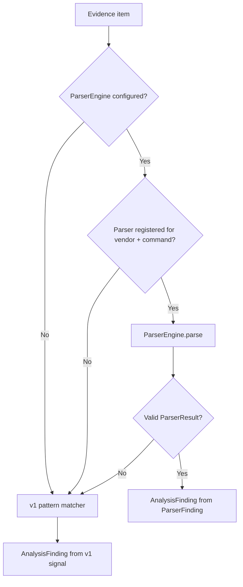

# Parser Analysis Integration

Sprint 2 deliverable: wire the parser framework into `AnalysisEngine` while preserving v1 pattern-matching fallback.

## Overview

`AnalysisEngine` now attempts parser-based analysis first for evidence items whose command has a registered vendor parser. When no parser is available, parsing fails, or output is invalid, the engine falls back to the existing deterministic v1 pattern matchers.

## Flow



## Components

| Component | Location | Role |
|-----------|----------|------|
| `AnalysisEngine` | `core/runtime/analysis_engine.py` | Parser-first analysis with v1 fallback |
| `build_default_parser_engine()` | `core/runtime/parser_bootstrap.py` | Register Cisco parsers by default |
| `RuntimeEngine.analyze_case()` | `core/runtime/runtime_engine.py` | Uses `AnalysisEngine` with default parser engine |
| `CiscoShowSipUaStatusParser` | `plugins/cisco/parser/show_sip_ua_status.py` | First integrated parser |

## Parser-First Rules

1. For each evidence item with `raw_text` and a normalized command:
2. If `ParserRegistry.has_parser(vendor, command)` → call `ParserEngine.parse(..., command=...)`
3. Convert each `ParserFinding` → `AnalysisFinding` with metadata:
   - `source: parser`
   - `parser_version`
   - `structured_data` (full parser structured output)
   - `parser_metadata`, `parser_warnings`
4. If parser unavailable or fails → use existing `COMMAND_ANALYZERS` v1 functions
5. v1 findings are tagged with `source: v1_pattern_match`

## Vendor Resolution

Parser vendor comes from `case.platform.vendor` (e.g. `cisco` from VP-CUBE-0001 playbook metadata).

## Default Runtime Behavior

`RuntimeEngine.analyze_case()` lazily bootstraps:

```python
from runtime.parser_bootstrap import build_default_parser_engine

parser_engine = build_default_parser_engine()  # registers Cisco parsers
AnalysisEngine(parser_engine=parser_engine).analyze(case)
```

If the Cisco plugin pack is not importable, analysis gracefully falls back to v1-only mode.

## Example

**Input:** `show sip-ua status` with disabled output

**Parser path:**
- `structured_data.sip_ua_enabled == False`
- Finding: `sip_ua_disabled` with parser metadata

**Fallback example:** `debug ccsip messages` with `503 Service Unavailable`

- No Cisco parser registered yet
- v1 `analyze_ccsip_debug()` emits `sip_503_detected`

## Design Constraints

- Parsers never modify `Case` directly
- `AnalysisEngine` maps `ParserResult` → `AnalysisFinding` and links `evidence_id`
- v1 pattern matching remains in place until additional parsers land
- `AnalysisFinding.metadata` stores parser structured output for downstream engines

## Tests

```bash
pytest tests/test_analysis_engine_parser_integration.py tests/test_analysis_engine.py -v
```

Coverage:
- Disabled SIP-UA via parser
- `structured_data` on finding metadata
- v1 fallback for `debug ccsip messages`
- `analyze_case` stores parser-generated findings
- Existing analysis tests unchanged

## Next Steps

- Add Cisco parsers for `show dial-peer voice summary` and `debug ccsip messages`
- Wire `CommandDetector` for command-less pasted output
- Deprecate overlapping v1 matchers as parser coverage grows
